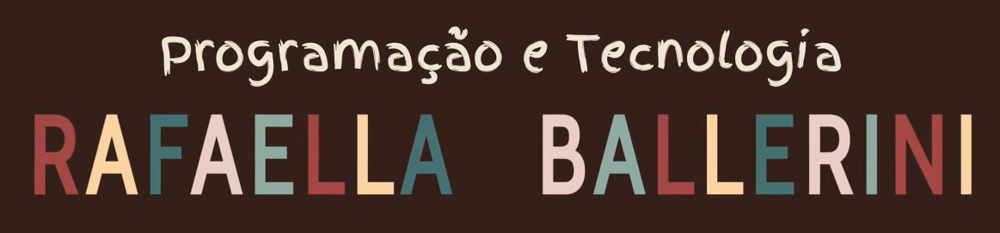

<h1 align="center">
  
</h1>

  Aula 01 do curso de JavaScript da Rafaella Balerini

  <a href="#-tecnologias">Tecnologias</a>&nbsp;&nbsp;&nbsp;|&nbsp;&nbsp;&nbsp;
  <a href="#-projeto">Projeto</a>&nbsp;&nbsp;&nbsp;|&nbsp;&nbsp;&nbsp;
  <a href="#-licença">Licença</a>&nbsp;&nbsp;&nbsp;|&nbsp;&nbsp;&nbsp;
  <a href="#-link-do-projeto">Link do Projeto</a>

  

 

---

## 📂 Projeto

  

---

## 🚀 Tecnologias

Esse projeto foi desenvolvido utilizando:

- HTML
- CSS
- JS

## 🔗 Link do Projeto

Para acessar o projeto <a href="" target="_blank">Clique Aqui</a>.

## 📝 Licença

Esse projeto está sob a licença MIT. Veja o arquivo [LICENSE](./LICENSE) para mais detalhes.

 

---

  

